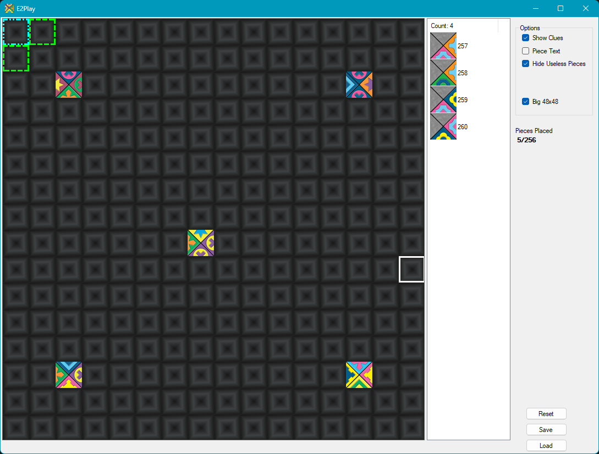
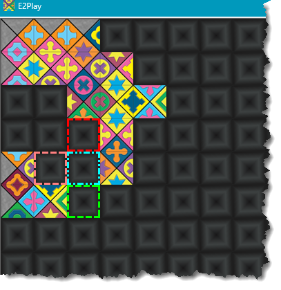
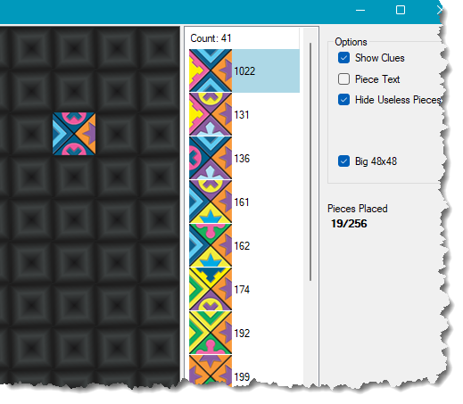
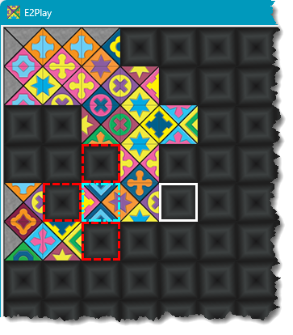
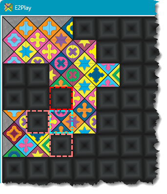
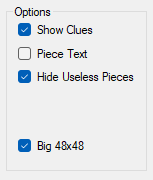
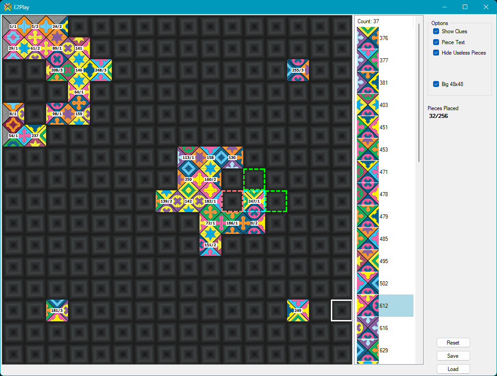
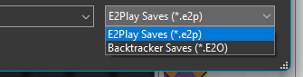

# **E2Play**

## Overview

E2Play is a program to place pieces for the Eternity II puzzle instead of manually trying to solve on a table. It's not a magic solver unfortunately but makes it a bit easier to try and manually solve the puzzle.

It's pretty basic and built using .Net Framework 4.7 so should run on just about any windows machine. It was created some time ago in VB but I've now moved it to C# as that is what I primarily use nowadays.

#### Running

You should be able to just download the .zip of the repository and run the .exe in the exe folder, or alternatively just take the 3 files from the exe folder and copy them locally into any folder in Windows.

The main window consists of 3 sections. The one on the left is the main board, next is the piece list window, and finally some options and a count of placed pieces.

The White square is the cursor and you move that to a square you want to place a tile. left click and the list of pieces will show up in the piece list window. The square you click on will change to Cyan and then other squares will highlight around that to show how many other pieces can fit in the surrounding squares.

Each coloured square means different numbers of pieces can fit there.

there are no pieces that can fit in this square

only 1 tile is available to fit in this square

at least 2 tiles are available for this square

at least 3 tiles are available for this square

at least 4 or more tiles are available.

In the example above, the selected tile (Cyan) is highlighted on row 5 column 3. There is no tile that can fit in the square above, only 1 tiles can go in the square to the left, and there are 4 or more tiles that can go in the square below.

With the square highlighted, click on a piece from the piece list to place it on the board.

Here I am selecting tile 1022.

Placing that tile on the selected square now shows all red surrounds so there are no tiles that could be placed after that one. You can either right click the selected tile to remove it from the board or go back to the piece list and pick another tile. This will swap the tile on the board with the new selection. Picking tile 354 instead now shows a piece can be placed left and bottom.

Not the best example as having no tile in that spot give a red square above the selection so no matter what tile you put there the one above will never have anything that can be placed there. You could place a tile and then go back and remove other tiles above to get better results although in this case the clue piece is in row 3 column 3 and can't be individually removed.

#### Options

Not a lot to pick from in the options.

If you don't want to use the clues then untick the "Show Clues" options. Clues will be available to use in the selections.

Hide Useless Pieces, should the only show selections in the piece list that when placed would have some tiles surrounding with 1 or more available pieces. Selections that would result in all surrounding tiles having 0 tiles that could be placed would get excluded from the selection list.

Big 48x48 is the regular size of the tiles. Unticking this will reduce the tiles size to 32x32 to cater for smaller laptop screens.

Piece Text will show the piece number and rotation for pieces placed on the board.

The piece text is either a single number or the piece number with a /rotation after it. The rotation is clockwise by the number so /1 is rotated 90 degrees clockwise /2 180 degrees and /3 270 degrees.

Underneath options show how many pieces of the 256 have been placed on the board.

#### Buttons

There are 3 buttons. Reset, Save and Load.

Reset will clear the board back to default. Save allows you to save the current layout to disk to resume later, and Load will allow you to load any saved sessions. You can have as many saves as you want just by using different filenames. Files are saved with the extension .e2p. You will notice when loading there is another option to load .E2O files.

This option allows loading of saved files from the backtracker solver into E2Play to work on. I'll get around to uploading the solver to GitHub at some stage :-)

## Development

The code is not elegant or pretty as it was a bit of a hack job moving it from some old VB code to C#. I've only recently started updating so will try and tidy things up a bit more and see if I can add any additional enhancements. I may try and incorporate the C++ solver code into it so it can be partially solved, then maybe manually tweaked, then get the solver to have another go. Not sure yet and depends on free time.

## Build

You should be able to download the zip (or clone) and just load the whole thing into Visual Studio and build. I've been using VS2022 but it's all stock windows controls so nothing special.

## License

All free...enjoy...