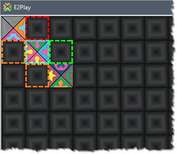
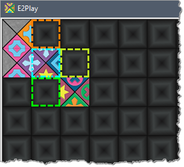

# **E2Play**

## Overview

E2Play is a program to place pieces for the Eternity II puzzle instead of manually trying to solve on a table. It's not a magic solver unfortunately but makes it a bit easier to try and manually solve the puzzle.

It's pretty basic and built using .Net Framework 2.0 so should run on just about any windows machine. It was created some time ago in VB but I've now moved it to C# as that is what I primarily use nowadays.

It consists of 2 main windows. The one on the left is the board, and the right a list of pieces that can fit in the selected spot. Click on a space on the board and a list of pieces will be shown that can fit there. the list will sometimes show more than 256 pieces as I've stored them all with all the rotations. Selecting a piece in the list will place it on the board and update the list accordingly. 

Select a place on the board with the left mouse button and pick a tile from the list on the right. To remove a tile right click on it. Selected tile is shown in Cyan.

It will also show you how many tiles will fit in the matching squares around it. The Colour represents how many tiles it can find to fit in the space.

| Colour | Number of matching pieces found |
| ------ | ------------------------------- |
| Red    | No matching tiles               |
| Pink   | Only 1 piece found              |
| Orange | 2 pieces found                  |
| Yellow | 3 pieces found                  |
| Green  | 4 or more pieces found          |

This image shows we've placed a tile on Row 1 Col 1 and you can see there are no tiles that can fit above and only 2 left or below.

In the next one we have 2 that can fit above and 3 to the right.

Most of the other stuff should be self explanatory.

Clicking Show Clues will place all the clue pieces on the board.

Reset clears the board to start over.

Save will save the current state to a file called E2Progress.e2p in the same folder as the .exe.

Load will load a saved progress.

## Development

I might look at tweaking it a bit from the original like adding piece numbers to the tile when I get a chance. Maybe extend the piece search on surrounding tiles based on what might be selected.

## Build

You should be able to just load the whole thing into Visual Studio and build.

## License

All free...enjoy...